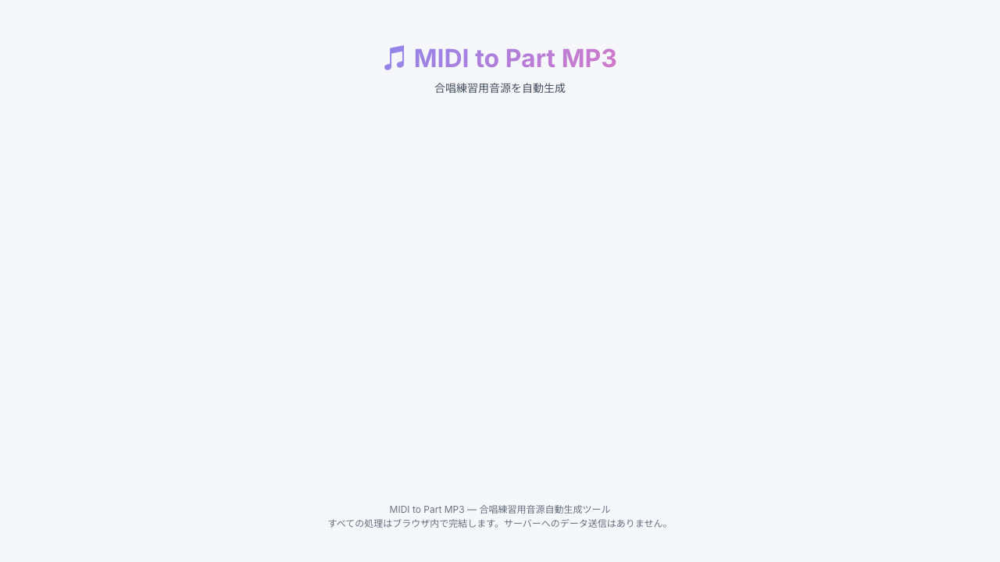
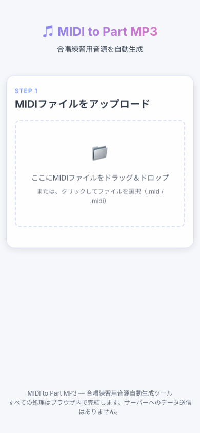

# Vertere - MIDI to MP3 Converter — 合唱練習用音源自動生成ツール

合唱の各パート（Soprano / Alto / Tenor / Bass / Piano）が**強調された練習用MP3**を、MIDIファイルから自動生成するWebアプリケーションです。

## 特徴

- 🎵 **MIDIアップロード** — 総譜でもパート別でも対応
- 🎤 **パート割り当て** — トラックごとにパート名を設定
- 🎹 **楽器選択** — クラリネット・ピアノ・ウッドブロックから選択
- 🏷️ **パート名カスタマイズ** — 出力ファイル名・進捗表示に反映
- 🔊 **音量バランス** — 主役パート以外の音量を自由に調整
- 📦 **ZIP一括ダウンロード** — 全パートのMP3をまとめてダウンロード
- ♻️ **再ダウンロード導線** — 完了後はワンクリックで同一ZIPを再取得
- 🌐 **完全クライアントサイド** — サーバー不要、GitHub Pagesで動作

## 技術スタック

| 領域 | 技術 |
|---|---|
| ビルド | Vite + TypeScript |
| MIDI解析 | @tonejs/midi |
| 音声合成 | Tone.js + OfflineAudioContext |
| 楽器音源 | gleitz/midi-js-soundfonts (フリー) |
| MP3エンコード | @breezystack/lamejs (Web Worker) |
| ZIP生成 | JSZip |

## 開発

```bash
npm install
npm run dev      # 開発サーバー
npm run build    # プロダクションビルド
npm run test     # テスト実行
npm run test:e2e # E2Eスモークテスト（自動でdev server起動）
npm run check:prod # 公開URLヘルスチェック
```

## 使い方

1. `.mid` / `.midi` ファイルをドラッグ＆ドロップ（複数可）
2. トラックごとに Part / Instrument を確認
3. 必要ならパート名と背景音量を調整
4. `🎵 練習音源を生成` を押して ZIP をダウンロード

## スクリーンショット

### Desktop



### Mobile



## 公開URL

- [https://ymgchj.github.io/midi_to_part_mp3_web.github.io/](https://ymgchj.github.io/midi_to_part_mp3_web.github.io/)

## 現在の実装状況

- コア処理（MIDI解析 / 音声レンダリング / MP3エンコード / ZIP化）は実装済み
- UIの基本フロー（アップロード→設定→生成→ダウンロード）は実装済み
- テストは `npm run test`（単体）と `npm run test:e2e`（生成フロー）で実行可能
- CI（GitHub Actions）で unit / e2e / build を自動検証
- 公開URLは定期ヘルスチェック（6時間ごと）を実行
- デモスクリーンショットは作成済み
- GitHub Pages公開URLで実環境表示を確認済み

## ドキュメント

| ファイル | 内容 |
|---|---|
| [CLAUDE.md](./CLAUDE.md) | AI開発者向け指示書 |
| [docs/ROADMAP.md](./docs/ROADMAP.md) | フェーズ別進捗 |
| [docs/ARCHITECTURE.md](./docs/ARCHITECTURE.md) | 技術設計 |
| [docs/SPEC.md](./docs/SPEC.md) | 中核ロジック仕様 |
| [docs/DESIGN.md](./docs/DESIGN.md) | デザイン仕様 |

## ステータス

✅ 主要機能実装完了（運用改善フェーズ）

## ライセンス

MIT
